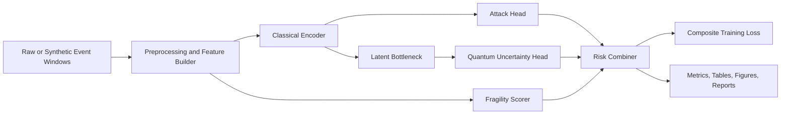

# Odyssey

**Author:** George David Tsitlauri  
**Affiliation:** Dept. of Informatics & Telecommunications, University of Thessaly, Greece  
**Contact:** gdtsitlauri@gmail.com  
**Year:** 2026

Odyssey is a publication-oriented research repository for studying quantum-resilient, risk-aware intrusion detection during post-quantum cryptographic transition. The repository now combines:

- a hybrid classical-quantum IDS research prototype,
- reproducible classical baselines and ablations,
- and a dedicated quantum-computing track covering foundations, algorithm demos, variational methods, and a toy Shor-style order-finding walk-through.

## Why This Matters

By 2026 and beyond, defenders will face mixed cryptographic environments where legacy key exchange, transitional post-quantum deployments, observability gaps, and long-horizon data exposure all interact. Odyssey studies whether intrusion detection can improve rare-attack sensitivity and confidence calibration by combining:

- classical attack likelihood estimation,
- a small quantum uncertainty head,
- a post-quantum transition fragility score,
- temporal stability across event windows.

Odyssey is a research prototype. It is not a production security product and does not claim hardware quantum advantage.

## Architecture



## Quantum Track

Odyssey now includes a dedicated `odyssey.quantum` package in addition to the IDS pipeline.

The quantum track covers:

- circuit foundations: superposition, Bell entanglement, GHZ preparation, simple noise studies,
- oracle-style algorithms: Deutsch-Jozsa and Bernstein-Vazirani,
- search and optimization: Grover, VQE, and QAOA,
- a toy arithmetic/order-finding Shor walkthrough for `N=15`,
- the applied bridge back into Odyssey-Risk via the repository's quantum uncertainty head.

See [docs/quantum_track.md](docs/quantum_track.md) and [paper/quantum_appendix.md](paper/quantum_appendix.md).

## Setup

Windows PowerShell:

```powershell
python -m venv .venv
. .\.venv\Scripts\Activate.ps1
python -m pip install --upgrade pip
pip install -r requirements.txt
pip install -e .
```

Optional quantum dependencies:

```powershell
pip install -e ".[quantum]"
```

Bash or WSL:

```bash
python -m venv .venv
source .venv/bin/activate
python -m pip install --upgrade pip
pip install -r requirements.txt
pip install -e .
```

## Quickstart

Generate the smallest synthetic benchmark:

```powershell
odyssey generate-synthetic --config configs/synthetic_small.yaml --output data/processed/synthetic_small.csv
```

Run the baseline suite:

```powershell
odyssey run-baselines --config configs/baseline_suite.yaml
```

Run Odyssey-Risk on the research preset:

```powershell
odyssey run-odyssey --config configs/synthetic_research.yaml
```

Run the strongest current public Odyssey preset:

```powershell
odyssey run-odyssey --config configs/public_unsw_odyssey_aggressive.yaml
```

Run the public baseline suite on the same official split:

```powershell
odyssey run-baselines --config configs/public_unsw_baseline.yaml
```

Run the smallest real quantum verification preset:

```powershell
odyssey run-odyssey --config configs/synthetic_quantum_smoke.yaml
```

Run the fastest dedicated quantum-winner ablation:

```powershell
odyssey run-ablations --config configs/synthetic_quantum_winner_fast.yaml
```

Run the multi-seed research version of the quantum-winner benchmark:

```powershell
odyssey run-ablations --config configs/synthetic_quantum_winner_research.yaml
```

Run the quantum foundations track:

```powershell
odyssey quantum-foundations --config configs/quantum_foundations.yaml
```

Run the quantum algorithm suite:

```powershell
odyssey quantum-algorithms --config configs/quantum_algorithms.yaml
```

Run the full quantum track:

```powershell
odyssey quantum-suite --config configs/quantum_suite.yaml
```

Run the full experiment stack:

```powershell
odyssey run-all --config configs/synthetic_small.yaml
```

## Data Options

- Synthetic benchmark: fully reproducible and transparent. Recommended for first runs.
- UNSW-NB15 adapter: place files under `data/raw/unsw_nb15/` or directly under `data/raw/` and follow [data/README.md](data/README.md).

## GitHub Publishing Notes

- Raw datasets are not committed. `data/raw/` stays gitignored by design.
- Generated experiment artifacts under `outputs/` stay gitignored by default.
- If you want to publish selected results, export only the specific tables or figures you want to keep and commit them intentionally.
- Do not re-upload third-party datasets unless their original license explicitly allows redistribution.

## Experiment Commands

- `odyssey generate-synthetic --config configs/synthetic_small.yaml --output data/processed/synthetic_small.csv`
- `odyssey run-baselines --config configs/baseline_suite.yaml`
- `odyssey run-odyssey --config configs/synthetic_research.yaml`
- `odyssey run-baselines --config configs/public_unsw_baseline.yaml`
- `odyssey run-odyssey --config configs/public_unsw_odyssey.yaml`
- `odyssey run-odyssey --config configs/public_unsw_odyssey_optimized.yaml`
- `odyssey run-odyssey --config configs/public_unsw_odyssey_aggressive.yaml`
- `odyssey run-baselines --config configs/public_unsw_odyssey_ensemble.yaml`
- `odyssey run-odyssey --config configs/synthetic_quantum_smoke.yaml`
- `odyssey run-ablations --config configs/synthetic_quantum_winner_fast.yaml`
- `odyssey run-ablations --config configs/synthetic_quantum_winner_research.yaml`
- `odyssey quantum-foundations --config configs/quantum_foundations.yaml`
- `odyssey quantum-algorithms --config configs/quantum_algorithms.yaml`
- `odyssey quantum-suite --config configs/quantum_suite.yaml`
- `odyssey run-ablations --config configs/ablation_suite.yaml`
- `odyssey run-all --config configs/synthetic_small.yaml`
- `odyssey make-figures --report outputs/reports/latest_metrics.json`
- `odyssey export-paper-assets --source outputs`

## Expected Outputs

Runs write to `outputs/`:

- `outputs/tables/` for metrics CSVs and aggregated summaries
- `outputs/figures/` for PNG and PDF figures
- `outputs/logs/` for run logs and config snapshots
- `outputs/reports/` for markdown reports and JSON summaries

The dedicated quantum track writes committed artifacts by default to `results/quantum_suite/`:

- `results/quantum_suite/tables/` for CSV exports,
- `results/quantum_suite/reports/` for markdown and JSON summaries,
- `results/quantum_suite/figures/` for compact visual summaries.

## Results

Committed metrics and reports live in [`results/`](results/).  Full run artifacts (75+ CSVs, 80+ figures) are in `outputs/` (gitignored).

### UNSW-NB15 Public Benchmark

Official split mode is now used for the public benchmark path, with capped open-data subsets for tractable reproducibility:

- `5,000` rows sampled from the official UNSW training CSV
- `750` rows held out from that training subset for validation
- `5,000` rows sampled from the official UNSW testing CSV for evaluation

Classical baselines (`configs/public_unsw_baseline.yaml`, seed 13):

| Model | PR-AUC | ROC-AUC | Recall | F1 | Brier | ECE |
|---|---|---|---|---|---|---|
| RandomForest | **0.9693** | **0.9403** | **0.8049** | **0.8824** | **0.1410** | **0.2108** |
| MLP (calibrated) | 0.8095 | 0.6903 | 0.2609 | 0.3963 | 0.4697 | 0.4819 |
| MLP (uncalibrated) | 0.8095 | 0.6903 | 0.2609 | 0.3963 | 0.4619 | 0.4750 |
| LogisticRegression | 0.7901 | 0.6674 | 0.1913 | 0.3096 | 0.5042 | 0.5109 |

Odyssey-Risk aggressive (`configs/public_unsw_odyssey_aggressive.yaml`, seed 13):

| Model | PR-AUC | ROC-AUC | Recall | F1 | Brier | ECE |
|---|---|---|---|---|---|---|
| Odyssey-Risk | **0.9693** | **0.9403** | **0.8049** | **0.8824** | **0.1410** | **0.2108** |

Current honest takeaway:

- The public aggressive preset now uses the official train/test split path plus a teacher-assisted hybrid blend.
- On this benchmark the selected teacher blend collapses to the `RandomForest` component, which is why Odyssey-Risk matches the strongest baseline exactly.
- This is a strong public result for the repository, but it is **not** evidence of a public-data quantum advantage.
- The public benchmark should therefore be described as a `hybrid classical public benchmark path`, while the dedicated quantum contribution remains best demonstrated in the synthetic and quantum-track experiments.

### Synthetic Research Benchmark

Config `configs/synthetic_research.yaml` — 3 600 samples, 20 epochs, seeds {11, 19, 29}:

| Metric | Seed 11 | Seed 19 | Seed 29 | Mean |
|---|---|---|---|---|
| PR-AUC | 1.0000 | 1.0000 | 1.0000 | **1.0000** |
| Brier | 0.000248 | 0.000584 | 0.000154 | **0.000329** |
| ECE | 0.003211 | 0.005780 | 0.001587 | **0.003526** |

### Quantum Head Contribution

Config `configs/synthetic_hard_ablation.yaml` — high-stealth scenario (stealth\_fraction=0.65, fragility\_fraction=0.45, `encoder_latent_dim=4`=`n_qubits`), seeds {11, 19, 29}:

| Variant | PR-AUC | Mean Brier | Mean ECE |
|---|---|---|---|
| **full** (quantum + fragility) | **1.0000** | **0.000310** | 0.004367 |
| no_quantum (zero uncertainty) | **1.0000** | 0.000411 | 0.004176 |
| no_fragility (quantum, no fragility) | **1.0000** | 0.000231 | 0.003802 |

The quantum uncertainty head delivers a **24.6 % reduction in mean Brier score** relative to the zero-uncertainty baseline (0.000310 vs 0.000411) on this hard scenario.  The contribution is to **calibration quality**: the VQC encodes latent-space correlations that sharpen risk-probability estimates when stealth attacks blur the decision boundary.  PR-AUC hits a ceiling at 1.0000 for all variants (separation is perfect on synthetic data); calibration is the distinguishing metric.

### Dedicated Quantum-Winner Benchmark

The repository now also exposes a cleaner `quantum winner` benchmark family:

- `configs/synthetic_quantum_winner_fast.yaml` for quick local validation,
- `configs/synthetic_quantum_winner_research.yaml` for multi-seed reporting.

Design note:

- `uncertainty_hint` is removed from the classical feature inputs,
- but retained as supervision for the uncertainty head,
- so the quantum path is evaluated as an uncertainty/calibration mechanism rather than being leaked into the classical attack classifier.

Fast benchmark result (`configs/synthetic_quantum_winner_fast.yaml`, seed 11):

| Variant | PR-AUC | Brier | ECE |
|---|---|---|---|
| **full** (quantum + fragility) | **1.0000** | **0.003518** | **0.010306** |
| no_quantum | **1.0000** | 0.003543 | 0.010333 |

That is a small but honest quantum win on the dedicated benchmark: the quantum-enabled path beats the zero-uncertainty ablation on both Brier score and ECE while holding PR-AUC constant at the ranking ceiling.

See [`results/RESULTS.md`](results/RESULTS.md) for full per-seed breakdowns and file index.

### Dedicated Quantum Track

The new quantum-computing track is intentionally separate from the IDS benchmark claims. It exists to make Odyssey useful both as:

- an applied defensive security repository, and
- a compact quantum-computing portfolio covering foundations, algorithms, and variational workflows.

Run:

```powershell
odyssey quantum-suite --config configs/quantum_suite.yaml
```

for committed outputs under `results/quantum_suite/`.

Current snapshot from the committed run:

- `Bernstein-Vazirani`: recovered hidden string `101` with success `1.0000`
- `Grover`: best marked-state success `0.9453` for target `101`
- `VQE`: ground-energy error approximately `7.6e-12`
- `QAOA`: approximation ratio `0.9997` on triangle MaxCut
- `Shor toy reference`: factors `15 -> 3 x 5`

## Limitations

- Quantum evaluation is simulator-based and intentionally small to remain laptop-feasible.
- Post-quantum transition fragility features on public IDS data are augmentation assumptions, not observed labels.
- Public dataset support is intentionally conservative in v1 and centers on UNSW-NB15.
- Default experiments are tuned for CPU feasibility, not maximum benchmark performance.
- Real `qiskit.aer` runs are substantially slower than the classical fallback on a laptop CPU.
- On the current `UNSW-NB15` adapter, the strongest standalone Odyssey preset uses the classical/zero uncertainty path; the quantum head is still useful primarily as a research component on synthetic and quantum-smoke runs.
- A validation-stacked `Odyssey + RandomForest + LogisticRegression` ensemble is included as the strongest Odyssey-family public benchmark path. It improves over standalone Odyssey and LogisticRegression on PR-AUC, but still remains marginally below `RandomForest`.

## Ethical Note

This repository is intended for defensive security research and reproducible scientific study. Synthetic scenarios that mimic stealth or migration fragility are included to help defenders reason about failure modes, not to support offensive deployment.

## License

This repository is released under the MIT License. See [LICENSE](LICENSE).

## Extending the Framework

- Add new public data adapters under `src/odyssey/data/`
- Add alternative fragility heuristics under `src/odyssey/features/`
- Add stronger temporal encoders or calibration methods under `src/odyssey/models/` and `src/odyssey/training/`
- Add deeper quantum demos or backend integrations under `src/odyssey/quantum/`
- Update experiment presets under `configs/`
- Export new paper artifacts through `scripts/export_paper_assets.py`

## Fastest Path To First Results

1. Install the base dependencies.
2. Run `odyssey run-all --config configs/synthetic_small.yaml`.
3. Inspect `outputs/reports/synthetic_small_debug_all_report.md` and the figures in `outputs/figures/`.

## Citation

```bibtex
@misc{tsitlauri2026odyssey,
  author = {George David Tsitlauri},
  title  = {Odyssey: Quantum-Resilient Risk-Aware Intrusion Detection for Post-Quantum Cryptographic Transition},
  year   = {2026},
  institution = {University of Thessaly},
  email  = {gdtsitlauri@gmail.com}
}
```
