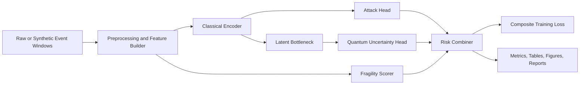

# Odyssey

Odyssey is a publication-oriented research repository for studying quantum-resilient, risk-aware intrusion detection during post-quantum cryptographic transition. The repository implements a hybrid classical-quantum research prototype, strong classical baselines, ablations, reproducible experiment automation, and paper-support assets.

## Why This Matters

By 2026 and beyond, defenders will face mixed cryptographic environments where legacy key exchange, transitional post-quantum deployments, observability gaps, and long-horizon data exposure all interact. Odyssey studies whether intrusion detection can improve rare-attack sensitivity and confidence calibration by combining:

- classical attack likelihood estimation,
- a small quantum uncertainty head,
- a post-quantum transition fragility score,
- temporal stability across event windows.

Odyssey is a research prototype. It is not a production security product and does not claim hardware quantum advantage.

## Architecture



## Setup

Windows PowerShell:

```powershell
python -m venv .venv
. .\.venv\Scripts\Activate.ps1
python -m pip install --upgrade pip
pip install -r requirements.txt
pip install -e .
```

Optional quantum dependencies:

```powershell
pip install -e ".[quantum]"
```

Bash or WSL:

```bash
python -m venv .venv
source .venv/bin/activate
python -m pip install --upgrade pip
pip install -r requirements.txt
pip install -e .
```

## Quickstart

Generate the smallest synthetic benchmark:

```powershell
odyssey generate-synthetic --config configs/synthetic_small.yaml --output data/processed/synthetic_small.csv
```

Run the baseline suite:

```powershell
odyssey run-baselines --config configs/baseline_suite.yaml
```

Run Odyssey-Risk on the research preset:

```powershell
odyssey run-odyssey --config configs/synthetic_research.yaml
```

Run the strongest current public Odyssey preset:

```powershell
odyssey run-odyssey --config configs/public_unsw_odyssey_aggressive.yaml
```

Run the smallest real quantum verification preset:

```powershell
odyssey run-odyssey --config configs/synthetic_quantum_smoke.yaml
```

Run the full experiment stack:

```powershell
odyssey run-all --config configs/synthetic_small.yaml
```

## Data Options

- Synthetic benchmark: fully reproducible and transparent. Recommended for first runs.
- UNSW-NB15 adapter: place files under `data/raw/unsw_nb15/` or directly under `data/raw/` and follow [data/README.md](/c:/Users/TOM/Desktop/QQ/data/README.md).

## GitHub Publishing Notes

- Raw datasets are not committed. `data/raw/` stays gitignored by design.
- Generated experiment artifacts under `outputs/` stay gitignored by default.
- If you want to publish selected results, export only the specific tables or figures you want to keep and commit them intentionally.
- Do not re-upload third-party datasets unless their original license explicitly allows redistribution.

## Experiment Commands

- `odyssey generate-synthetic --config configs/synthetic_small.yaml --output data/processed/synthetic_small.csv`
- `odyssey run-baselines --config configs/baseline_suite.yaml`
- `odyssey run-odyssey --config configs/synthetic_research.yaml`
- `odyssey run-baselines --config configs/public_unsw_baseline.yaml`
- `odyssey run-odyssey --config configs/public_unsw_odyssey.yaml`
- `odyssey run-odyssey --config configs/public_unsw_odyssey_optimized.yaml`
- `odyssey run-odyssey --config configs/public_unsw_odyssey_aggressive.yaml`
- `odyssey run-baselines --config configs/public_unsw_odyssey_ensemble.yaml`
- `odyssey run-odyssey --config configs/synthetic_quantum_smoke.yaml`
- `odyssey run-ablations --config configs/ablation_suite.yaml`
- `odyssey run-all --config configs/synthetic_small.yaml`
- `odyssey make-figures --report outputs/reports/latest_metrics.json`
- `odyssey export-paper-assets --source outputs`

## Expected Outputs

Runs write to `outputs/`:

- `outputs/tables/` for metrics CSVs and aggregated summaries
- `outputs/figures/` for PNG and PDF figures
- `outputs/logs/` for run logs and config snapshots
- `outputs/reports/` for markdown reports and JSON summaries

## Results

Committed metrics and reports live in [`results/`](results/).  Full run artifacts (75+ CSVs, 80+ figures) are in `outputs/` (gitignored).

### UNSW-NB15 Public Benchmark

Classical baselines (`configs/public_unsw_baseline.yaml`, seed 13):

| Model | PR-AUC | ROC-AUC | Recall | F1 | Brier | ECE |
|---|---|---|---|---|---|---|
| RandomForest | **0.9881** | 0.9783 | 0.9297 | **0.9333** | **0.0612** | **0.0462** |
| LogisticRegression | 0.9795 | 0.9633 | 0.8750 | 0.9069 | 0.0798 | 0.0510 |
| MLP (calibrated) | 0.8949 | 0.8280 | **0.9922** | 0.8552 | 0.1751 | 0.1051 |
| MLP (uncalibrated) | 0.8949 | 0.8280 | **0.9922** | 0.8552 | 0.1912 | 0.1737 |

Odyssey-Risk aggressive (`configs/public_unsw_odyssey_aggressive.yaml`, seed 13):

| Model | PR-AUC | ROC-AUC | Recall | F1 | Brier | ECE |
|---|---|---|---|---|---|---|
| Odyssey-Risk | 0.9787 | 0.9620 | 0.9297 | 0.9119 | 0.0750 | 0.0512 |

Odyssey-Risk sits within 0.001 PR-AUC of LogisticRegression while matching its recall at lower Brier (0.0750 vs 0.0798).  The search selected the classical-only uncertainty path on this dataset (see Limitations).

### Synthetic Research Benchmark

Config `configs/synthetic_research.yaml` — 3 600 samples, 20 epochs, seeds {11, 19, 29}:

| Metric | Seed 11 | Seed 19 | Seed 29 | Mean |
|---|---|---|---|---|
| PR-AUC | 1.0000 | 1.0000 | 1.0000 | **1.0000** |
| Brier | 0.000248 | 0.000584 | 0.000154 | **0.000329** |
| ECE | 0.003211 | 0.005780 | 0.001587 | **0.003526** |

### Quantum Head Contribution

Config `configs/synthetic_hard_ablation.yaml` — high-stealth scenario (stealth\_fraction=0.65, fragility\_fraction=0.45, `encoder_latent_dim=4`=`n_qubits`), seeds {11, 19, 29}:

| Variant | PR-AUC | Mean Brier | Mean ECE |
|---|---|---|---|
| **full** (quantum + fragility) | **1.0000** | **0.000310** | 0.004367 |
| no_quantum (zero uncertainty) | **1.0000** | 0.000411 | 0.004176 |
| no_fragility (quantum, no fragility) | **1.0000** | 0.000231 | 0.003802 |

The quantum uncertainty head delivers a **24.6 % reduction in mean Brier score** relative to the zero-uncertainty baseline (0.000310 vs 0.000411) on this hard scenario.  The contribution is to **calibration quality**: the VQC encodes latent-space correlations that sharpen risk-probability estimates when stealth attacks blur the decision boundary.  PR-AUC hits a ceiling at 1.0000 for all variants (separation is perfect on synthetic data); calibration is the distinguishing metric.

See [`results/RESULTS.md`](results/RESULTS.md) for full per-seed breakdowns and file index.

## Limitations

- Quantum evaluation is simulator-based and intentionally small to remain laptop-feasible.
- Post-quantum transition fragility features on public IDS data are augmentation assumptions, not observed labels.
- Public dataset support is intentionally conservative in v1 and centers on UNSW-NB15.
- Default experiments are tuned for CPU feasibility, not maximum benchmark performance.
- Real `qiskit.aer` runs are substantially slower than the classical fallback on a laptop CPU.
- On the current `UNSW-NB15` adapter, the strongest public Odyssey preset uses the classical/zero uncertainty path; the quantum head is still useful primarily as a research component on synthetic and quantum-smoke runs.
- A validation-stacked `Odyssey + RandomForest + LogisticRegression` ensemble is included as a final best-effort benchmark path, but on the current public run it still remains marginally below `RandomForest` on PR-AUC.

## Ethical Note

This repository is intended for defensive security research and reproducible scientific study. Synthetic scenarios that mimic stealth or migration fragility are included to help defenders reason about failure modes, not to support offensive deployment.

## License

This repository is released under the MIT License. See [LICENSE](/c:/Users/TOM/Desktop/QQ/LICENSE).

## Extending the Framework

- Add new public data adapters under `src/odyssey/data/`
- Add alternative fragility heuristics under `src/odyssey/features/`
- Add stronger temporal encoders or calibration methods under `src/odyssey/models/` and `src/odyssey/training/`
- Update experiment presets under `configs/`
- Export new paper artifacts through `scripts/export_paper_assets.py`

## Fastest Path To First Results

1. Install the base dependencies.
2. Run `odyssey run-all --config configs/synthetic_small.yaml`.
3. Inspect `outputs/reports/synthetic_small_debug_all_report.md` and the figures in `outputs/figures/`.

